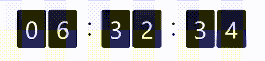

# React Countdown Flip Card



**react-countdown-flip-card** is a simple component for you to perform top-to-bottom flipping animation when countdown.

## Demo & Examples

To run the example locally:
1. Build the library
```
yarn
yarn build
```

2. Start the example
```
cd example
yarn
yarn start
```

Then [`localhost:3000`](http://localhost:3000) should open in a browser. If not
you can go to that directly.

## Installation

To use react-countdown-flip-card, install it from NPM with yarn using the command:

```
yarn add react-countdown-flip-card
```

## Usage

To use this component, first import ReactCardFlip:

```javascript
import FlipCard from 'react-countdown-flip-card';
```

and then provide it with a digitt display, and optional width/height in pixel.

```javascript
import { useEffect, useState } from 'react';
import FlipCard from 'react-countdown-flip-card';

function App() {
  const [digit, setDigit] = useState(9)

  useEffect(() => {
    setTimeout(() => setDigit(digit === 0 ? 9 : digit-1), 1000)
  }, [digit])

  return (
    <FlipCard digit={String(digit)} width={60} height={80} />
  );
}

export default App;
```

### Properties

| Props                | Type   | Description                                                                                                                 | Default      |
| -------------------- | ------ | --------------------------------------------------------------------------------------------------------------------------- | ------------ |
| digit                | string | **Required**. Digit to be display on the card.                                                                              | undefined |
| className            | string | _(Optional)_. Custom class name for styling.                                                                                | undefined |
| width                | number | _(Optional)_. Width of the card in pixel                                                                                    | 40 |
| height               | number | _(Optional)_. Height of the card in pixel                                                                                   | 50 |

## Development

The source code for the component is in `src`. 

To build, watch and serve the examples (which will also watch the component source), move to  `example` directory and run run `npm run start`.


## Contributing

Fork this repo, add your proposed features and make a pull request. I will review as soon as possible.

## License

This project is licensed under the terms of the MIT license.